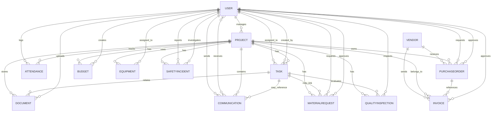

# Construction Management Backend API

Backend service for managing construction projects, workforce operations, procurement, budgets, safety, quality, and communication.

## 1) Project Purpose

This application provides a centralized backend for construction operations. It helps teams:

- Manage users and role-based workforce profiles.
- Plan and track projects and tasks.
- Record field attendance with location and working hours.
- Manage vendors, material requests, purchase orders, invoices, and budgets.
- Track equipment allocation and maintenance state.
- Report safety incidents and run quality inspections.
- Share project communications.
- Upload and manage project/task documents.

It is built as a REST API using Django + Django REST Framework.

## 2) Implemented Functional Modules

### Authentication and User Management

- Custom user model with roles:
  - admin
  - project_manager
  - site_engineer
  - foreman
  - subcontractor
  - worker
  - safety_officer
  - quality_inspector
- User registration endpoint.
- JWT login endpoint (access + refresh tokens).
- Full CRUD user management via API.

### Project Management

- Project lifecycle tracking:
  - planning, active, on_hold, completed, cancelled
- Project type tracking:
  - residential, commercial, industrial, infrastructure
- Budget, schedule, geo-location, and project manager assignment.
- Computed project progress based on completed tasks.

### Task Management

- Task assignment, priority, status, start/due dates.
- Progress tracking with estimated/actual hours.
- Task dependency mapping (self-referential many-to-many).

### Attendance and Field Operations

- Attendance with check-in/check-out, GPS coordinates, notes.
- Auto working-hours and overtime calculation.
- Date uniqueness per user + project.
- Custom actions:
  - check_in
  - check_out
- Optional project/user filtering for attendance listing.
- Geo-fence helper method exists in model (`is_within_project_radius`).

### Document Management

- Project/task-linked document records.
- File upload support with project-specific path.
- Document type and versioning metadata.

### Vendor and Procurement

- Vendor registry and approval tracking.
- Material request workflow.
- Purchase order creation and approval lifecycle.

### Financial Control

- Budget by category and fiscal year.
- Remaining amount computed as:
  - allocated - spent - committed
- Invoice management with status and optional purchase-order linkage.

### Equipment Management

- Equipment inventory.
- Assignment to projects and staff.
- Lifecycle status and maintenance fields.

### Safety and Quality

- Safety incident reporting and investigation state tracking.
- Quality inspections by project/task with score and findings.

### Communications

- Project messages with sender and many receivers.
- Message type tagging (general, urgent, safety_alert, progress_update, issue_report).

## 3) Technology Stack

- Python 3.x
- Django 4.2.x
- Django REST Framework
- djangorestframework-simplejwt (JWT auth)
- django-cors-headers
- SQLite (default in current settings)

## 4) Current Security and Runtime Configuration

From current settings:

- Global DRF authentication: JWTAuthentication.
- CORS: allow all origins.
- ALLOWED_HOSTS: `*`.
- DEBUG: `True`.

Important note:

- `AttendanceViewSet` uses a custom `APIKeyPermission` that checks header:
  - `X-API-Key: construct-api-key-2024`
- This overrides global JWT auth for attendance endpoints in current implementation.

## 5) Setup and Run

## Prerequisites

- Python 3.10+ (recommended)
- pip

## Installation

```bash
python -m venv venv
venv\Scripts\activate
pip install -r requirements.txt
```

## Database Setup

```bash
python manage.py makemigrations
python manage.py migrate
```

## Create Admin User (optional)

```bash
python manage.py createsuperuser
```

## Run Server

```bash
python manage.py runserver
```

Base API URL:

- `http://localhost:8000/api/auth/`

## 6) API List (Implemented Endpoints)

All resources below are under `/api/auth/`.

### Authentication

- `POST /signup/` - Register user.
- `POST /login/` - Login and get JWT tokens.

### Standard CRUD Endpoints (DRF ModelViewSet)

Each resource supports:

- `GET /<resource>/`
- `POST /<resource>/`
- `GET /<resource>/<id>/`
- `PUT /<resource>/<id>/`
- `PATCH /<resource>/<id>/`
- `DELETE /<resource>/<id>/`

Resources:

- `users`
- `projects`
- `tasks`
- `documents`
- `vendors`
- `purchaseorders`
- `budgets`
- `attendance`
- `invoices`
- `equipment`
- `incidents`
- `communications`
- `material-requests`
- `quality-inspections`

### Custom/Filtered API Behavior

- Attendance filters:
  - `GET /attendance/?user=<user_id>`
  - `GET /attendance/?project=<project_id>`
- Attendance custom actions:
  - `POST /attendance/check_in/`
  - `PATCH /attendance/<id>/check_out/`
- Invoice filter:
  - `GET /invoices/?project=<project_id>`

## 7) API Usage Structure (Typical Workflow)

1. Register or create user accounts (`signup` or `users`).
2. Login via `login` to obtain JWT access token.
3. Create project records.
4. Create tasks and assign users.
5. Raise material requests and create purchase orders.
6. Register vendors and process invoices.
7. Allocate budgets and monitor spending.
8. Track attendance, equipment usage, safety incidents, and quality inspections.
9. Share communications and upload documents throughout execution.

## 8) Database Structure (Current Models)

Default DB engine in this project is SQLite (`db.sqlite3`).

### Tables / Entities

1. `User`
- Extends Django `AbstractUser`.
- Key fields: role, phone, employee_id (unique), department, hire_date, is_active_employee.

2. `Project`
- Key fields: project_code (unique), client, manager, type, status, dates, budget, location, coordinates.
- FK: project_manager -> User.

3. `Task`
- Key fields: task_code, title, status, priority, progress_percentage, hours.
- FK: project -> Project, assigned_to -> User, created_by -> User.
- M2M: dependencies -> Task (self).
- Unique together: (project, task_code).

4. `Attendance`
- Key fields: date, check_in_time, check_out_time, latitude, longitude, hours_worked, overtime_hours.
- FK: user -> User, project -> Project.
- Unique together: (user, project, date).

5. `Document`
- Key fields: document_type, title, file, version, is_active.
- FK: project -> Project, task -> Task (nullable), uploaded_by -> User (nullable).

6. `Vendor`
- Key fields: vendor_code (unique), vendor_type, contact details, rating, is_approved.

7. `PurchaseOrder`
- Key fields: po_number (unique), amount, tax, status, order/delivery dates.
- FK: vendor -> Vendor, project -> Project, requested_by -> User, approved_by -> User (nullable).

8. `Budget`
- Key fields: category, allocated_amount, spent_amount, committed_amount, fiscal_year.
- FK: project -> Project, created_by -> User (nullable).
- Unique together: (project, category, fiscal_year).

9. `Invoice`
- Key fields: invoice_number (unique), subtotal, tax, total, status, dates.
- FK: vendor -> Vendor, purchase_order -> PurchaseOrder (nullable), project -> Project, approved_by -> User (nullable).

10. `Equipment`
- Key fields: equipment_id (unique), category, model, serial, status, maintenance dates, location.
- FK: current_project -> Project (nullable), assigned_to -> User (nullable).

11. `SafetyIncident`
- Key fields: incident_id (unique), severity, status, details, incident/reported dates.
- FK: project -> Project, reported_by -> User (nullable), investigated_by -> User (nullable).

12. `Communication`
- Key fields: message_type, subject, message, is_read, timestamp.
- FK: sender -> User, project -> Project, task -> Task (nullable).
- M2M: receivers -> User.

13. `MaterialRequest`
- Key fields: request_id (unique), material_description, quantity, unit, estimated_cost, urgency, status, required_date.
- FK: project -> Project, task -> Task (nullable), requested_by -> User, approved_by -> User (nullable).

14. `QualityInspection`
- Key fields: inspection_id (unique), inspection_type, scheduled/actual date, status, checklist, defects, score.
- FK: project -> Project, task -> Task, inspector -> User.

### Relationship Overview (ER-style)



## 9) Project Structure (Key Files)

```text
construct-backend--main/
|- manage.py
|- db.sqlite3
|- requirements.txt
|- construction_mgmt/
|  |- settings.py
|  |- urls.py
|  |- asgi.py
|  |- wsgi.py
|- core/
|  |- models.py
|  |- serializers.py
|  |- views.py
|  |- urls.py
|  |- permissions.py
|  |- admin.py
|  |- migrations/
|- complete_curl_commands.md
|- enhanced_curl_commands.md
|- curl_commands.md
```

## 10) Existing API Example Docs in Repo

- `complete_curl_commands.md`
- `enhanced_curl_commands.md`
- `curl_commands.md`

These files contain sample cURL calls for common workflows.

## 11) Current Gaps / Notes

- Automated tests are currently minimal (`core/tests.py` is empty template).
- Many endpoints rely on default ModelViewSet behavior without custom business-rule validation in view layer.
- Production hardening is still needed (DEBUG, wildcard hosts, open CORS, secret handling).
- `attendance/check_in/` sets `user` from `request.user.id`, so requests should include valid JWT authentication even though attendance permission currently checks API key.

---

If needed, this README can be extended further with:

- Request/response JSON schema per endpoint.
- Postman collection import and environment variables.
- Role-permission matrix endpoint by endpoint.